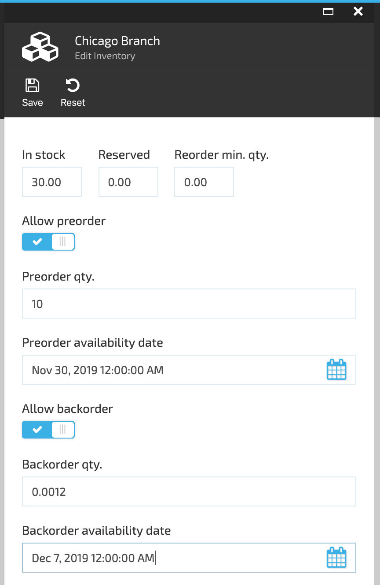
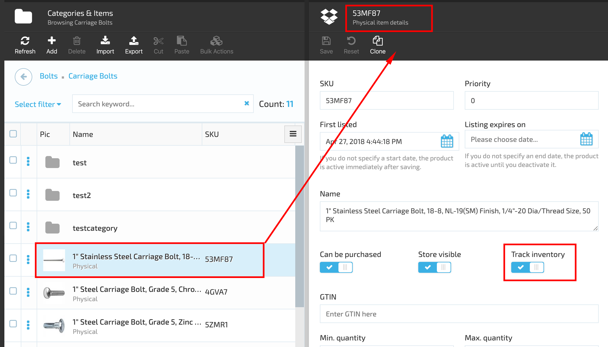

# Overview

Inventory management is a system of stock level controlling and fulfillment centers management.

Inventory is often the largest item a business has in its current assets, meaning it must be accurately monitored. Inventory is counted and valued at the end of each accounting period to determine the company's profits or losses.

In the ecommerce sector, a day-to-day management of inventory helps increase business intelligence and visibility. Ecommerce business owners have better ongoing control when they have constant eyes on inventory.

## Key Features

1. Inventory tracking
1. Stock level controlling
1. Fulfillment center management
1. Preoder and backorder functions included
1. Easily customized

## VirtoCommenrce Inventory Module Description

VirtoCommerce.Inventory module represents a store inventory management system. The main goal of the Inventory module is stock level controlling and managing of fulfillment centers.

The VC Inventory module is customizable and supports metafields.

The Inventory module content can be both exported and imported using the VC Export/Import functionality.

Fields description :

1. 'In stock' - total quantity of product items allowed in stock;
1. 'Reserved'- in VC this field currently is simply a UI element, but can be customized if needed, based on client's business needs.
1. 'Reorder min. qty'- the minimum quantity of products that can be reordered;
1. 'Allow preorder' - if switched on means that the system will allow order products that are still not in stock. By using the preorder calendar, the admin can set up the time period for preorder availability;
1. 'Preorder qty field'- the admin can specify the product quantity that can be preordered;  
1. 'Allow backorder'- if switched on means that the system will allow order products that are no longer in stock. The admin can set up the time period for backorder availability;
1. 'Backorder qty' field- the admin can specify the product quantity that can be backordered.

Some products may not require inventory tracking. For example, services, second hand or custom-made goods. In this case, a store owner can select not to track inventory, by switching off the 'Track Inventory' option on the Physical item details blade

### Fulfillment Centers

VC fulfillment includes the steps involved in receiving, processing and delivering orders to end customers. Usually the process of fulfillment in ecommerce inlcudes receiving inventory from a supplier (including its counting, inspecting, labeling and etc.), storage of the inventory, order processing (including preparing, packing and exchange if necessary) and shipping. There also may be returns that are counted according to the store rules and conditions. In Virto Commerce manager fulfillment lifecycle looks as follows:

1. Shipment created-
This is the first step of fulfillment. A shipment includes one or more products of the order. Order can contain one or more shipments.
1. Inventory assigned-
When shipment is created, it is checked if the inventory is available. Afterwards the inventory is being assigned.
1. Released for Pick/Pack-
Assigned inventory is released for pick or pack by a customer service representative (CSR). Then the inventory is being picked to the picklist and prepared to be packed
1. Packing -
On this step the shipment is packed according to shipping requirements (for instance, fragile items must be packed more accurately and the pack should be marked).
1. Shipped-
When the packed shipment is sent to delivery service to be shipped.

[Manage Fulfillment Centers](manage-fullfilment.md)

### Installation

Installing the module:
* Automatically: in VC Manager go to More -> Modules -> Inventory module -> Install

* Manually: download module zip package from https://github.com/VirtoCommerce/vc-module-inventory/releases.
 In VC Manager go to More -> Modules -> Advanced -> upload module package -> Install.

### Available resources

* Module related service implementations as a <a href="https://www.nuget.org/packages/VirtoCommerce.InventoryModule.Data" target="_blank">NuGet package</a>

* API client as a <a href="https://www.nuget.org/packages/VirtoCommerce.InventoryModule.Client" target="_blank">NuGet package</a>

* API client documentation https://admin-demo.virtocommerce.com/docs/index.html?urls.primaryName=VirtoCommerce.Inventory