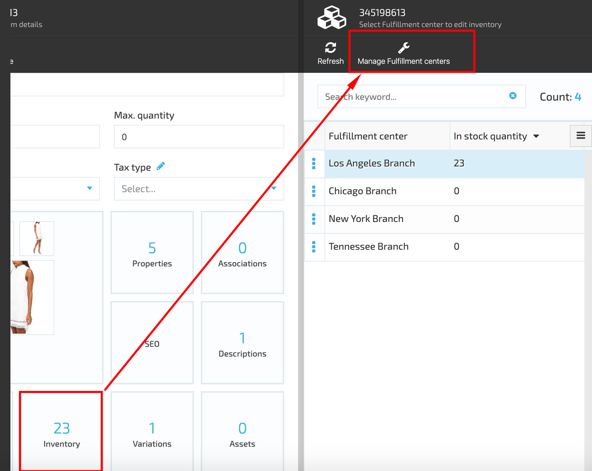
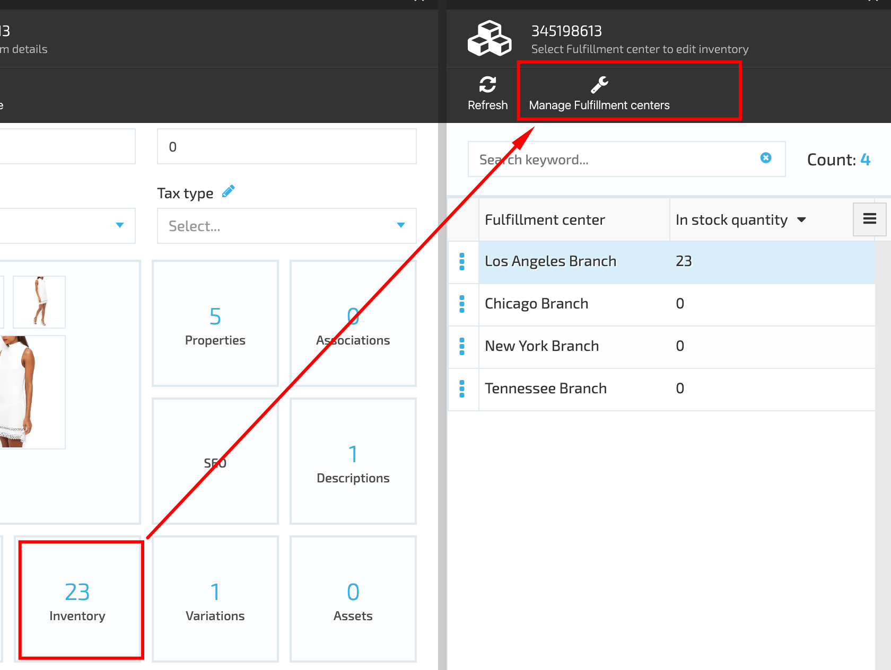
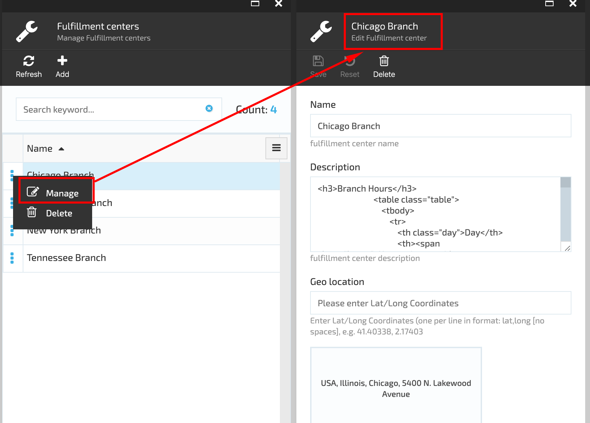
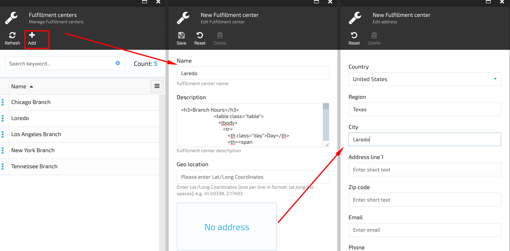

# Manage Fulfillment Centers

VC Inventory Module allows managing multiple fulfillment centers. In order to access the list of fulfillment centers, the user should select More->Catalog-> Categories & Items-> Item details-> Inventory widget.

## View And Edit Fulfillment Center Details

In order to view the details of a specific fulfillment center and edit it, the user should click the 'Manage Fulfillment Centers' button as seen on the screenshot below:

The system will open the 'Manage Fulfillment centers' blade. The user should click on the three dots menu located on the left side of the selected fulfillment center and select the 'Manage' option:

The system will display the Fulfillment Center details in editable format. The user can edit the following fields in the opened blade:

1. Name;
1. Description;
1. Geo Location;
1. Address.

Once the details are edited, the user should click the 'Save' button and the changes will be saved.

## Delete Fulfillment Center

The system allows deleting the fulfillment centers from the list. In order to delete the selected fulfillment center, the user should select the 'Delete' option under the three dots menu. The system will display a warning message that the fulfillment center will be deleted. The user should confirm the deletion and the fulfillment center will be removed from the system.

## Add Fulfillment Center

The user can add as many fulfillment centers as necessary. To add a new fulfillment center the user should click the 'Add' button on the 'Manage Fulfillment centers' blade and complete the form on 'Edit Fulfillment center' blade. Once the form is completed, the user should save the changes. The new fulfillment center will be added and displayed in the list.

